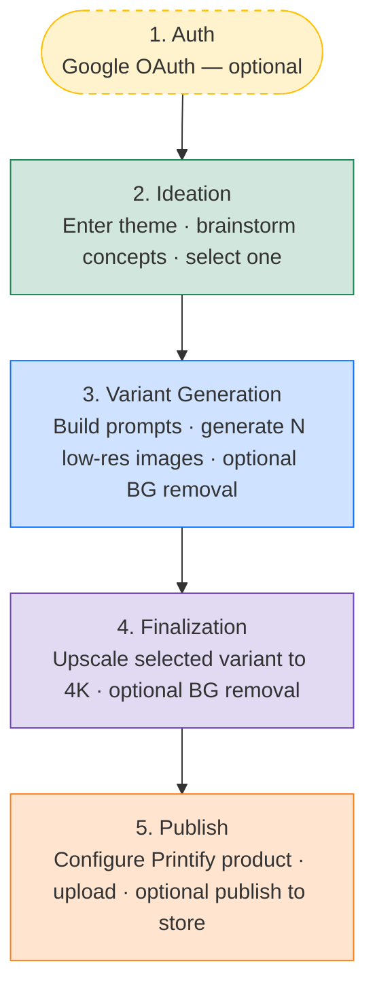

# Workflow Diagrams Update Implementation Plan

> **For agentic workers:** REQUIRED SUB-SKILL: Use superpowers:subagent-driven-development (recommended) or superpowers:executing-plans to implement this plan task-by-task. Steps use checkbox (`- [ ]`) syntax for tracking.

**Goal:** Replace the single outdated `docs/workflow.mmd` with two accurate Mermaid diagrams — a high-level overview and a per-phase detail — and update `CLAUDE.md` to reference both.

**Architecture:** Rename the existing file to `workflow_overview.mmd` and rewrite it as a 5-node linear diagram. Create `workflow_detail.mmd` as a multi-subgraph diagram with all decision points and loop-backs matching the current code. Update `CLAUDE.md` to point to both files.

**Tech Stack:** Mermaid (`graph TD`), Markdown

---

## File Map

| Action | Path | Responsibility |
|---|---|---|
| Rename + rewrite | `docs/workflow_overview.mmd` | 5-phase linear happy-path overview |
| Create | `docs/workflow_detail.mmd` | Full per-phase detail with all decision loops |
| Modify | `CLAUDE.md` | Point Logic Blueprint to both new files |
| Reference (read-only) | `docs/superpowers/specs/2026-04-13-workflow-diagrams-design.md` | Approved spec |

---

### Task 1: Rename and rewrite `workflow_overview.mmd`

**Files:**
- Modify (rename): `docs/workflow.mmd` → `docs/workflow_overview.mmd`

- [ ] **Step 1: Rename the file**

```bash
mv docs/workflow.mmd docs/workflow_overview.mmd
```

- [ ] **Step 2: Overwrite with the high-level overview diagram**

Replace the entire file content with:



- [ ] **Step 3: Verify the file renders (visual check)**

Open `docs/workflow_overview.mmd` in a Mermaid preview (VS Code with Mermaid extension, or paste into https://mermaid.live). Confirm:
- Five nodes visible in a vertical chain
- Auth node has a dashed border
- No parse errors shown

- [ ] **Step 4: Commit**

```bash
git add docs/workflow_overview.mmd
git commit -m "docs: rename workflow.mmd to workflow_overview.mmd with accurate 5-phase overview"
```

---

### Task 2: Create `workflow_detail.mmd`

**Files:**
- Create: `docs/workflow_detail.mmd`

- [ ] **Step 1: Create the detail diagram**

Write the following to `docs/workflow_detail.mmd`:

```mermaid
graph TD

    %% ── 1. Auth ──────────────────────────────────────────────────────────────
    subgraph Auth [1. Auth — optional Google OAuth]
        PageLoad([Page load]) --> AuthEnabled{GOOGLE_CLIENT_ID\nconfigured?}
        AuthEnabled -- No --> AppHome
        AuthEnabled -- Yes --> OAuthRedirect[Redirect to Google OAuth]
        OAuthRedirect --> AllowlistCheck{Email in\nALLOWED_EMAILS?}
        AllowlistCheck -- No --> LoginError([Show login error])
        AllowlistCheck -- Yes --> AppHome([App home])
    end

    %% ── 2. Ideation ──────────────────────────────────────────────────────────
    subgraph Ideation [2. Ideation]
        EnterTheme([Enter theme]) --> Brainstorm[POST /brainstorm\nGemini generates text concepts]
        Brainstorm --> ViewConcepts(View concept list)
        ViewConcepts --> IdeationChoice{Action?}
        IdeationChoice -- "Pick / edit concept" --> ConceptSelected([Concept selected])
        IdeationChoice -- "New theme" --> EnterTheme
    end

    %% ── 3. Prompt Building ───────────────────────────────────────────────────
    subgraph PromptBuild [3. Prompt Building]
        ConceptIn([Concept + templates]) --> LoadPreset{Load preset?}
        LoadPreset -- Yes --> ApplyPreset[GET /presets/:name\nReplace template fields]
        LoadPreset -- No --> BuildPrompts
        ApplyPreset --> BuildPrompts[POST /generate\nBuild N variant prompts]
        BuildPrompts --> GenImages([Generate N low-res images])
    end

    %% ── 4. Variant Generation ────────────────────────────────────────────────
    subgraph VariantGen [4. Variant Generation]
        ViewVariants(View N low-res variants) --> PickVariant[Pick a variant]
        PickVariant --> VariantChoice{Action?}
        VariantChoice -- "Remove BG" --> RemoveBGVariant[POST /remove-bg/variant\nUpdate variant in session]
        RemoveBGVariant --> ViewVariants
        VariantChoice -- "Rerender" --> RerenderVariants([Back to Prompt Building])
        VariantChoice -- "Finalize" --> ReadyToFinalize([Proceed to Finalization])
    end

    %% ── 5. Finalization ──────────────────────────────────────────────────────
    subgraph Finalize [5. Finalization]
        ClickFinalize([Click Finalize]) --> Gen4K[POST /finalize\nUpscale to 4K\nAuto-remove BG if variant had it]
        Gen4K --> View4K(View 4K image)
        View4K --> FinalChoice{Action?}
        FinalChoice -- "Remove BG" --> RemoveBGFinal[POST /remove-bg/final\nUpdate final in session]
        RemoveBGFinal --> View4K
        FinalChoice -- "Re-finalize\n(edit prompt)" --> ClickFinalize
        FinalChoice -- "Publish" --> ReadyToPublish([Proceed to Publish])
    end

    %% ── 6. Publish ───────────────────────────────────────────────────────────
    subgraph Publish [6. Publish — Printify]
        OpenPrintify([Open Printify panel]) --> SelectShop[GET /printify/shops\nSelect shop]
        SelectShop --> SelectBlueprint[GET /printify/blueprints\nSearch & select blueprint]
        SelectBlueprint --> SelectProvider[GET /printify/blueprints/:id/providers\nSelect print provider]
        SelectProvider --> SelectVariants[GET /printify/blueprints/:id/providers/:id/variants\nSelect colors & sizes]
        SelectVariants --> SetDetails[Set title · description · price\nAdjust position & scale]
        SetDetails --> PublishChoice{Publish now?}
        PublishChoice -- Yes --> PublishNow[POST /printify/publish\nUpload image · create product · publish]
        PublishChoice -- No --> SaveDraft[POST /printify/publish\nUpload image · create product draft]
        PublishNow --> Done([Product live in store])
        SaveDraft --> Done2([Product saved as draft])
    end

    %% ── Phase transitions ────────────────────────────────────────────────────
    AppHome --> EnterTheme
    ConceptSelected --> ConceptIn
    GenImages --> ViewVariants
    RerenderVariants -.-> ConceptIn
    ReadyToFinalize --> ClickFinalize
    ReadyToPublish --> OpenPrintify

    %% ── Styling ──────────────────────────────────────────────────────────────
    style Auth fill:#fff9e6,stroke:#ffc107,stroke-dasharray: 5 5
    style Ideation fill:#e9f7ef,stroke:#198754
    style PromptBuild fill:#e8f4fd,stroke:#0d6efd
    style VariantGen fill:#eef2ff,stroke:#4361ee
    style Finalize fill:#f3e8ff,stroke:#6f42c1
    style Publish fill:#fff3e8,stroke:#fd7e14
    style LoginError fill:#f8d7da,stroke:#dc3545
    style Done fill:#d1e7dd,stroke:#198754
    style Done2 fill:#d1e7dd,stroke:#198754
```



- [ ] **Step 2: Verify the file renders (visual check)**

Open `docs/workflow_detail.mmd` in a Mermaid preview. Confirm:
- Six labeled subgraphs visible
- All loop-back arrows present (BG removal loops within Variant Gen and Finalization)
- Rerender dashed arrow returns to Prompt Building
- No parse errors

- [ ] **Step 3: Commit**

```bash
git add docs/workflow_detail.mmd
git commit -m "docs: add workflow_detail.mmd with full per-phase logic including all decision loops"
```

---

### Task 3: Update `CLAUDE.md`

**Files:**
- Modify: `CLAUDE.md`

- [ ] **Step 1: Replace the Logic Blueprint line**

Find this line in `CLAUDE.md`:

```
- **Logic Blueprint:** `docs/workflow.mmd`
```

Replace it with:

```
- **Logic Blueprint (overview):** `docs/workflow_overview.mmd`
- **Logic Blueprint (detail):** `docs/workflow_detail.mmd`
```

- [ ] **Step 2: Verify the change**

```bash
grep -n "Logic Blueprint" CLAUDE.md
```

Expected output:
```
<line>:- **Logic Blueprint (overview):** `docs/workflow_overview.mmd`
<line>:- **Logic Blueprint (detail):** `docs/workflow_detail.mmd`
```

- [ ] **Step 3: Commit**

```bash
git add CLAUDE.md
git commit -m "docs: update CLAUDE.md Logic Blueprint references to overview and detail diagrams"
```
